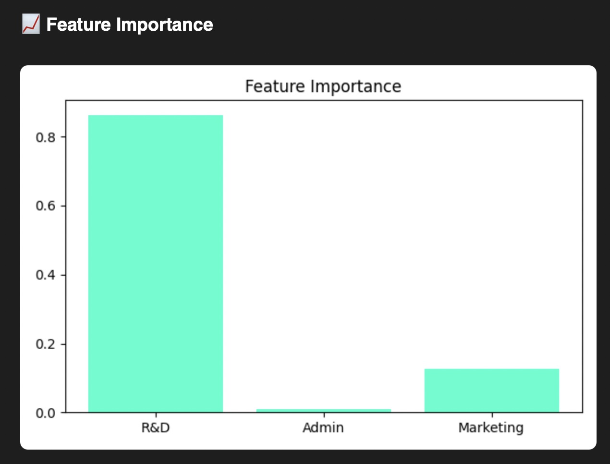
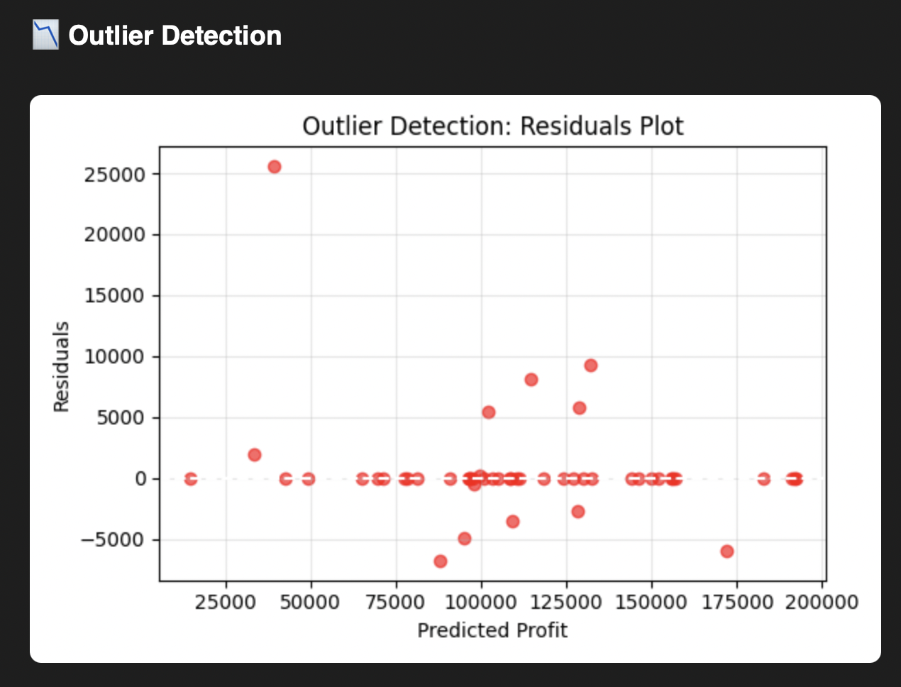

# Company Profit Prediction using Multiple Linear Regression

## 📌 Overview
This project predicts the **profit of a company** based on:
- R&D Spend
- Administration Cost
- Marketing Spend

## 📂 Dataset
- **Source:** Sample dataset of company expenses and profits
- **Columns:**
  - `R&D Spend`
  - `Administration`
  - `Marketing Spend`
  - `State`
  - `Profit`

---

## 🛠️ Tech Stack
- **Python 3.12.4**
- **Scikit-learn**
- **Pandas, NumPy**
- **Streamlit**
- **Pickle** (for model serialization)

---

## 🚀 Features
- **Profit Prediction**: Predicts profit using R&D, Administration, and Marketing spend.
- **Feature Importance**: Shows which features have the most impact on profit.
- **Outlier Detection**: Visualizes and identifies data points that deviate significantly.
- **Batch Predictions**: Upload a CSV and get predictions for multiple records.
- **Clean UI**: Built using Streamlit for an interactive experience.

---

## 📊 Screenshots

### 🏆 Feature Importance

### 📉 Outlier Detection

---

## How to run 

1. Install dependencies - pip install -r requirements.txt
2. Run the appication - python app.py

