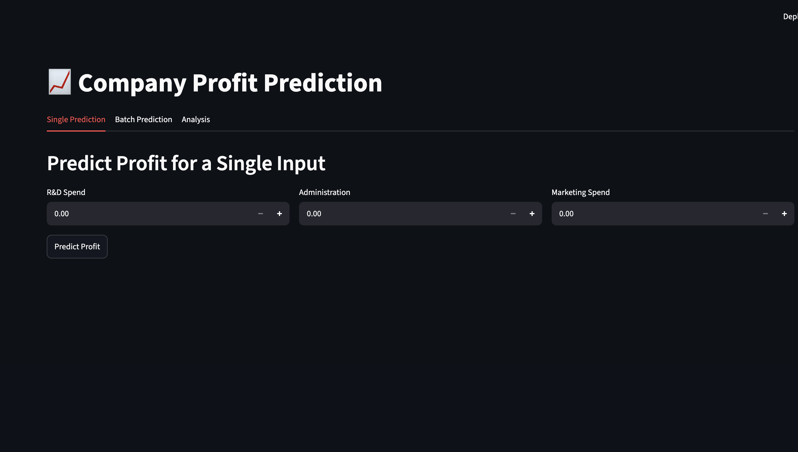
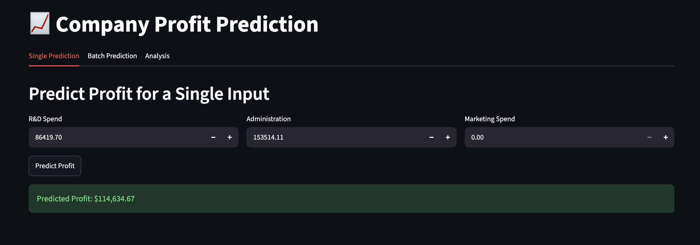
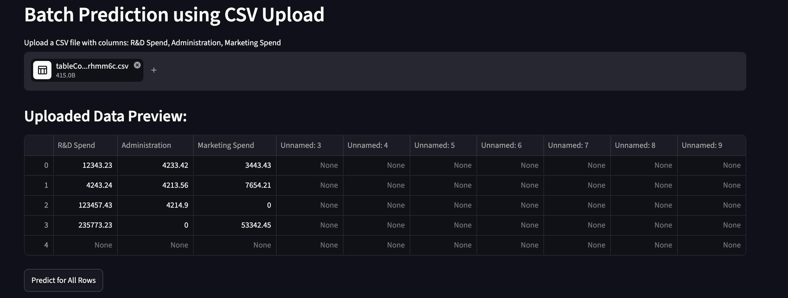
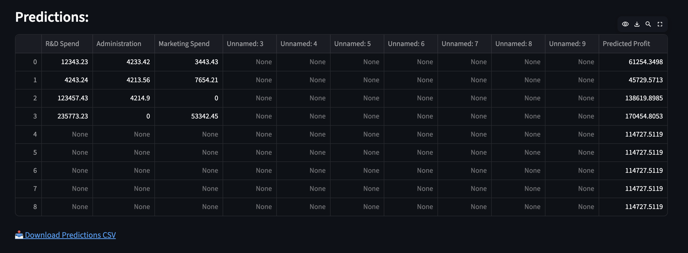
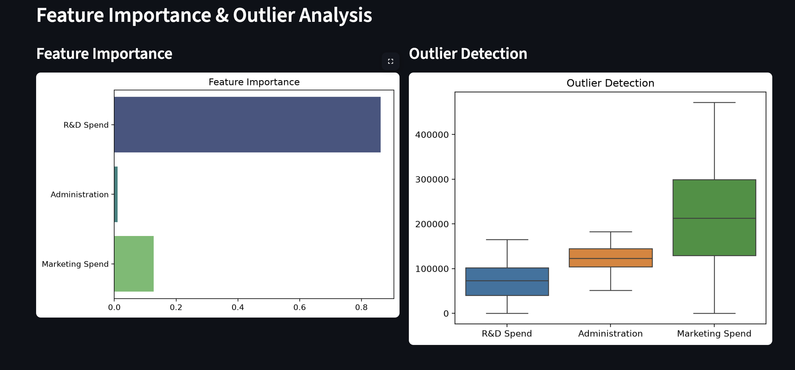

# 📈 Company Profit Prediction using Machine Learning

An end-to-end Machine Learning web application that predicts a company's profit based on **R&D Spend, Administration Cost, and Marketing Spend**. Built with **Python, Scikit-learn, and Streamlit**, the application provides real-time predictions, batch processing, and interactive data visualizations.

---

## 🚀 Live Demo

🔗 **Streamlit App:** *Coming Soon*

---

## 📌 Features

- 📊 Predict company profit using a trained Machine Learning model
- 📁 Batch prediction through CSV file upload
- 📈 Feature importance visualization
- 📉 Outlier detection using box plots
- ⚡ Fast and interactive Streamlit interface
- 💾 Download prediction results as CSV

---

## 🖥️ Application Preview

> Add screenshots here after deployment.

### Home Page

<p align="center">
  
</p>

### Single Prediction

<p align="center">
  
</p>

### Batch Prediction

<p align="center">
  
</p>

<p align="center">
  
</p>

### Feature Importance

<p align="center">
  
</p>

---

# 📂 Project Structure

```
Company-Profit-Prediction/
│
├── app.py
├── train_model.py
├── evaluation.py
├── requirements.txt
├── README.md
├──dataset.csv
│
├── models/
│   ├── best_model.pkl
│   └── scaler.pkl
│
├── Internship.ipynb
├── screenshots/

```

---

# ⚙️ Technologies Used

- Python
- Pandas
- NumPy
- Scikit-learn
- Streamlit
- Matplotlib
- Joblib

---

# 🤖 Machine Learning Workflow

1. Data Collection
2. Data Cleaning & Preprocessing
3. Exploratory Data Analysis
4. Feature Engineering
5. Model Training
6. Model Evaluation
7. Best Model Selection
8. Model Deployment with Streamlit

---

# 📊 Model Performance

| Metric | Score |
|---------|-------|
| Best Model | Extra Trees Regressor |
| R² Score | **0.9511** |

---

# 📈 Application Features

### ✅ Single Prediction

Predict the expected company profit using:

- R&D Spend
- Administration Cost
- Marketing Spend

---

### ✅ Batch Prediction

Upload a CSV file containing multiple records and receive predictions for all entries simultaneously.

---

### ✅ Feature Importance

Visualize which features contribute the most toward predicting company profit.

---

### ✅ Outlier Detection

Interactive box plots help identify anomalies in the dataset.

---

# 💻 Installation

Clone the repository

```bash
git clone https://github.com/Rishi3154/Company-Profit-Prediction.git
```

Navigate into the project

```bash
cd Company-Profit-Prediction
```

Install dependencies

```bash
pip install -r requirements.txt
```

Run the application

```bash
streamlit run app.py
```

The application will be available at

```
http://localhost:8501
```

---

# 📊 Dataset

The dataset contains historical company expenditure data with the following features:

- R&D Spend
- Administration
- Marketing Spend
- Profit (Target Variable)

---

# 🔮 Future Improvements

- Hyperparameter optimization
- Cross-validation comparison dashboard
- Model explainability using SHAP
- Additional regression model benchmarking
- Cloud deployment with CI/CD
- Docker support

---

# 👨‍💻 Author

**Rishi Shah**

📧 Email: *shahrishi660@gmail.cpm*

🔗 LinkedIn: www.linkedin.com/in/rishishah3154

💻 GitHub: https://github.com/Rishi3154

---

## ⭐ Support

If you found this project helpful, consider giving it a ⭐ on GitHub!
